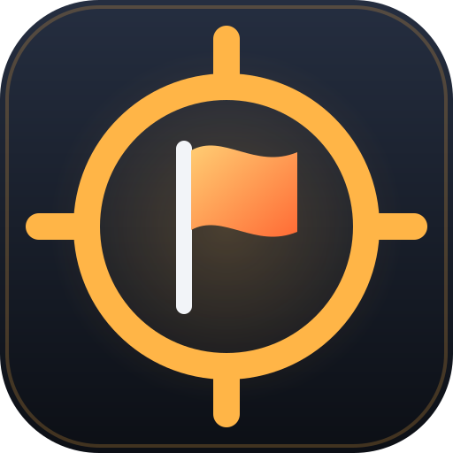

<p align="center"></p>

# Arena FPS

A multiplayer browser FPS built with **Three.js**, with realtime sync over **Firebase Realtime Database**.
Pick a name, create or join a room, and shoot each other in Free-for-all, Team Deathmatch or Capture the Flag.

## Quick start (local, no Firebase account needed)

Requires Node 20+ and Java (for the Firebase emulator).

```bash
npm install
npm run emulator      # terminal 1 — local Realtime Database on :9000
npm run dev:emu       # terminal 2 — game on http://localhost:5173
```

Open the game in two browser windows, create a room in one and join it from the other.

## Using a real Firebase project

1. Create a project at https://console.firebase.google.com
2. **Build → Realtime Database → Create database**, picking the location closest to your players (it can't be
   changed later; this game's live database is in Singapore, `asia-southeast1`)
3. **Project settings → Your apps → Web app**, then copy the config values.
4. `cp .env.example .env` and fill them in (`VITE_FIREBASE_DATABASE_URL` is the important one).
5. Paste `database.rules.json` into **Realtime Database → Rules** (or `firebase deploy --only database`).
6. `npm run dev`. Use `npm run build` to get a static `dist/` you can host anywhere (Firebase Hosting, Netlify, …).

To play with friends on your LAN while developing, run `npm run dev -- --host`.

## Game modes

Every mode is one of three **base types**, which decide teams, flags and how points are scored, plus a set of
**rules** on top. The room's creator picks a mode in the lobby; the room list shows its badge and name.

| Base | Goal | Default time limit | Or ends early at |
| --- | --- | --- | --- |
| **FFA** — Free-for-all | Most kills | 8 min | 25 kills by one player |
| **TDM** — Team Deathmatch | Red vs Blue; every kill scores for the killer's team | 10 min | 50 team kills |
| **CTF** — Capture the Flag | Grab the enemy flag and bring it to your own base | 12 min | 3 captures |

**Rules** (`src/game/rules.ts`), all optional on top of the base:

| Rule | Options |
| --- | --- |
| Loadout | Standard (rifle + pickups), Rifles / Shotguns / Snipers / Deagles only (endless ammo, no other guns or ammo boxes), or the Gun Game ladder (FFA only) |
| Pickups | Gun pickups, ammo boxes, abilities: each on or off |
| Headshots only | Body hits do nothing; grenades don't spawn |
| Score limit | FFA 5–60 kills, TDM 10–150 team kills, CTF 1–10 captures |
| Time limit | 3–20 minutes |
| Health | 25–200 HP (medkits heal up to it, the health bar and name tags scale to it) |
| Respawn | 1–10 seconds |
| Speed / gravity | 70–150 % movement speed, 30–150 % gravity (low gravity = higher, floatier jumps) |

**Prebuilt modes:**

| Badge | Mode | Base | What's different |
| --- | --- | --- | --- |
| FFA / TDM / CTF | Free-for-all, Team Deathmatch, Capture the Flag | – | The plain base modes |
| GG | Gun Game | FFA | Every kill hands you the next gun on a 12-step ladder; first through it wins. No pickups |
| SNP | Sniper Only | FFA | Snipers only, 20 kills |
| SNT | Sniper TDM | TDM | Snipers only, 40 team kills |
| SNF | Sniper Flags | CTF | Snipers only |
| SHG | Shotgun Brawl | FFA | Shotguns only, 110 % speed |
| DGL | Hand Cannons | FFA | Deagles only |
| HS | Headhunter | FFA | Headshots only, 15 kills |
| HC | Hardcore TDM | TDM | 50 HP, no abilities, 6 s respawn, 40 team kills |
| TNK | Tank CTF | CTF | 200 HP, 90 % speed |
| MOON | Moon Gravity | FFA | 35 % gravity, 110 % speed |
| SPD | Speed Rush | FFA | 145 % speed, 1 s respawn, 30 kills |

**Custom modes:** **＋ Create custom mode** in the lobby opens an editor: pick the base, name it (and a badge of
up to 4 letters), set every rule, and see a live description. **Use once** plays it in the room you create;
**Save & use** also keeps it under your modes (in this browser, up to 12; ✎ edits, ✕ deletes). The Discord
lobby has the same picker. A room's rules are stored with it (`lobby/{code}/rules`, checked by the database
rules), so everyone who joins plays the same; rooms made before custom modes keep working (their old mode
names map to the matching prebuilt mode).

- **Teams:** you join the smaller team. Every player's uniform takes their team colour (65%, with a faint glow
  and a glowing visor, so teams stay readable in shadow). Teammates' names show whenever they're in sight, and a
  teammate hidden behind cover is drawn over the walls as just a flat 2D silhouette of their character (same pose
  and animation, gun included) in team colour (`src/game/xray.ts`; enemies are never shown through walls),
  bullets and grenades pass through them, and you spawn on your own half (red owns +z, blue −z).
  The pause menu (Esc) has a **Switch team** button.
- **Capture the Flag:** each base is a glowing pad near the back wall with the team's flag on it.
  Walk over the enemy flag to take it, then walk onto your own base to score — only while your own flag is home.
  **While you carry the flag your guns and grenades are stowed: the flag is your only weapon.** Click (or ●)
  to swing it: 55 damage, 80 to the head, 2.4 m reach, one swing every 0.7 s, so two hits take most people down.
  Swings are forgiving to aim (a fan of short rays across your view) but walls block them. Other players see
  the carrier's gun disappear and the swing as an arm strike, and the kill feed shows ⚑ for flag kills.
  A carrier who dies (or switches team, or leaves) drops the flag where they stood. Touch your own dropped flag
  to send it home; otherwise it returns by itself after 20 s. The score bar shows where both flags are.
- **Rounds:** the score bar shows the round clock, which turns red in the last 30 s. When the time runs out,
  the best score wins; a tie is a draw. A score limit ends the round early. Then:
  1. **Results** (6 s): the winner, why the round ended, and the top three.
  2. **MVP** (10 s): a replay of the MVP's highlight, seen through their eyes, with their card and the next
     map. It's skipped when nobody got a kill or a capture.
  3. **Next map:** a new round starts on a new map with a fresh seed. Scores reset, flags go home, pickups
     are cleared and everyone respawns. The lobby list shows the map currently being played.

### MVP

Each player tracks their own best highlight of the round and publishes it with their stats:

| Highlight | Score |
| --- | --- |
| Multi-kill: each kill within 4 s of the last (Double / Triple / Quad Kill / Rampage) | 10 × kills² |
| Flag capture (CTF), plus 25 for each kill made while carrying | 60 + 25 per kill |
| Killing the enemy flag carrier | 35 |
| Streak of 5+ kills without dying | 8 per kill |
| Any kill (headshot) | 5 (15) |

The MVP has the best highlight score plus 0.3 × (kills × 4 + captures × 25 + damage ÷ 40). The client that
ends the round picks the MVP and the next map, and stores them in the round record, so everyone shows the
same ones.

The replay works because every client records the round as it plays: everyone's positions about 10 times a
second, plus shots, kills, grenades and flag moves. When the MVP screen starts, it replays the highlight from
1.5 s before to 1.5 s after with stand-in avatars, tracers, grenades and carried flags, seen in first person through the MVP's eyes (their gun in view, raised when they aimed, flashing when they fired).
A player who joined after the highlight sees a slow fly-around of the map instead. Highlights longer than
9 s play faster to fit.

Round times use the Firebase server clock (`.info/serverTimeOffset`), so every client moves through the
screens together.

Limits and team colors are in `src/game/modes.ts`.

## Maps

Every room gets its own arena, generated from a **seed**. The lobby shows a top-down preview of the map for the
current seed: press 🎲 for a new one, type a seed a friend shared to get the same map, or type `classic` for
the original hand-built arena (rooms made before seeds existed also use it). The pause menu and the Tab
summary show the room's map and seed.

- The seed picks a theme (Training Yard, Dust Bowl, Frostbite, Dusk Yard, Toxic Works: sky, floor and colors),
  a centerpiece and 10–16 pieces of cover: crates, walls, **low cover** (1.1–1.25 m: hides you crouched, shoot
  over it standing), pillars, climbable stacks, L-shaped corners and **decks** (a 1.3–1.7 m platform with a
  ramp up one side and a crate on top). The platform centerpiece has ramps on two sides and steps on the others.
- **Ramps** (`src/game/ramps.ts`) are real slopes: you walk up and down them, their sides block you like a wall
  until the slope is low enough to step onto, and running downhill sticks to the surface. Ledges up to 0.7 m
  (steps, the top of a ramp) are walked straight onto without jumping. Bullets hit ramps like any cover.
- Maps are mirrored on both axes, so every spawn and both CTF bases face the same layout.
- Cover never blocks a spawn point or a flag base, and every gap between obstacles is at least 1.6 m wide,
  so no part of the floor can be sealed off.
- Generation is pure, seeded code (`src/game/mapgen.ts`), so every client builds the identical arena.

### Textures

Every texture is drawn in code when the game starts (`src/game/textures.ts`), so there are no image files.
They take a few hundred ms the first time and are cached after that. They use tileable noise so they repeat
without seams, and they tile at real-world scale instead of stretching across long walls.

| Theme | Floor | Walls | Pillars |
| --- | --- | --- | --- |
| Training Yard | tiles | concrete | corrugated metal |
| Dust Bowl | sand ripples | brick | concrete |
| Frostbite | snow | concrete | corrugated metal |
| Dusk Yard | cracked asphalt | brick | corrugated metal |
| Toxic Works | diamond plate | corrugated metal | concrete |

- Crates are wooden, with planks and a brace.
- The outer wall is concrete panels with grime at the bottom.
- The sky is a dome with a gradient and clouds.
- Spawn points have painted floor markers, and CTF bases have hazard stripes.
- The gun is worn metal and wood, grenades have a segmented shell, and pickups sit on metal pedestals.
- A map's surfaces come from its theme and piece types, never from the seed's random numbers, so adding
  textures didn't change any existing seed's layout.

## Damage direction and hit feedback

When you're hit, a red arc around the crosshair points toward where it came from: the shooter's position for
bullets, the explosion for grenades. Each attacker gets their own arc, which keeps pointing at that spot as you
turn, stays up for 0.6 s and fades over the next second. Bigger hits draw a thicker arc. It still shows when your
shield absorbs the damage.

Hits also shake the camera for about half a second, harder for bigger hits (off in Settings → Screen shake).
At 30 health or less the edges of the screen darken red and pulse, and a heartbeat plays, both faster and
heavier the closer to death you are.

## Announcer and music

Multi-kills (two kills within 4 s of each other) put a **DOUBLE / TRIPLE / QUAD KILL / RAMPAGE** banner on
screen with a stinger that gets bigger up the ladder; every fifth kill of a streak calls out the streak. Rounds
start and end with short stingers (a win resolves upward, a loss falls, a draw hangs). In the last 30 seconds
of a round a low synthesized bed comes in, with a kick pulse that quickens as the clock runs out. Effects and
music have separate volume sliders in Settings.

## Sound

All sound is synthesized with Web Audio (no audio files), including footsteps:

- One step per stride while moving on the ground (faster and louder when sprinting), plus a thud when you land
  from a jump or a drop.
- Other players' steps fade with distance (silent beyond 35 m) and are panned left/right toward where they are,
  so you can hear someone coming.
- Each step layers a scuff, a heel click and a deep thud: a falling 55–75 Hz sine with a quiet octave above it
  (so laptop speakers still carry it) plus low, muffled noise. Landings go deeper and longer. All game sound
  runs through a limiter so stacked sounds don't distort.
- The sound depends on what's underfoot: hard floor, sand (Dust Bowl), snow (Frostbite), or hollow wood on top
  of a crate.

## Discord Activity

The same build also runs as a Discord Activity: players launch it from a voice channel and play inside
Discord, with no website to visit.

- Everyone in the same voice channel shares one match; the room code comes from Discord's instance id.
  The first player picks the mode and starts; the rest press **Join match**.
- Players are signed in with Discord (`identify` scope only) and use their Discord display name.
- Works on desktop and in Discord's mobile apps (touch controls, landscape).

### How it works

- **Proxy rewrites:** Discord only lets an Activity reach the internet through its proxy, using the URL
  mappings below. `src/discord/patch.ts` is imported first and rewrites requests onto those mappings.
  It must come first because Firebase captures the `WebSocket` constructor as soon as it loads.
  Firebase sometimes reconnects to a "shard" server whose name can't be known in advance, so those
  connections are sent back to the database's main host, which serves the same data.
- **Sign-in:** the Discord client hands over a one-time code, and `netlify/functions/discord-token.mjs`
  trades it for an access token. That step needs the app's client secret, so it runs on Netlify, never in
  the browser.
- **Differences inside Discord:** no fullscreen, key lock or "Leave site?" prompt. If Discord refuses mouse
  capture (pointer lock), aiming falls back to a hidden free cursor; looking around then stops at the edge
  of the window. Esc pauses.

### Setup

1. **Create the app:** in the [Discord Developer Portal](https://discord.com/developers/applications),
   create an application.
2. **OAuth2:** add the redirect `https://127.0.0.1` (Discord requires one; the SDK doesn't use it). Note
   the **Client ID** and **Client Secret**.
3. **Installation:** enable **User Install** and **Guild Install**.
4. **Activities → URL Mappings:**

   | Prefix | Target |
   | --- | --- |
   | `/` | `shootup-arena-fps.netlify.app` |
   | `/firebase` | `arena-fps-asia-wezlh-default-rtdb.asia-southeast1.firebasedatabase.app` |
   | `/api` | `shootup-arena-fps.netlify.app/.netlify/functions` |

5. **Activities → Settings:** enable Activities. This creates the "Launch" command.
6. **Client ID in the build:** put `VITE_DISCORD_CLIENT_ID=<client id>` in `.env`. It's public.
7. **Secrets on Netlify:** set `DISCORD_CLIENT_ID` and `DISCORD_CLIENT_SECRET` in the site's environment
   variables. Never put the secret in `.env` or in the code.
8. **Deploy:** run `npm run build && npx netlify-cli deploy --prod --dir dist --functions netlify/functions`.
9. **Launch:** in Discord, turn on Developer Mode (User Settings → Advanced), join a voice channel, open the
   Activity launcher and start the game. Until the app is verified, only you and members of its developer
   team can see it.

## Controls

| Key | Action |
| --- | --- |
| WASD | Move |
| Mouse | Aim |
| Left click (hold) | Shoot (automatic) |
| Right click (hold) | Aim down sights |
| Space | Jump |
| Shift | Sprint |
| Ctrl (hold) | Crouch; press while sprinting to slide |
| R | Reload |
| Q / mouse wheel | Switch between the rifle and a picked-up gun |
| 1 / 2 / 3 | Use the ability in that slot |
| I | Inventory (details + drop items) |
| Tab (hold) | Match summary |
| Esc | Pause / switch team / spectate / leave room |

### Settings

The ⚙ panel (lobby or pause menu) has mouse sensitivity, aim sensitivity and aim toggle, invert Y, fullscreen,
**field of view** (60–110°), **graphics quality** (Low: no shadows and a 1× resolution cap; Medium: soft
shadows at native resolution; High: sharp shadows, up to 2×; phones default to Low), **crosshair colour and
size** (with a live preview), sound effects and music volume, screen shake, **reduce motion** (System / On /
Off: no pulsing, zooming or camera shake; "System" follows the OS setting), **HUD size** (80–140 %; panels grow
from the corner they're pinned to), a button to show the one-time tips again, and every key binding (hidden on
touch screens, where the mouse section becomes "Look"). Settings are saved in the browser.

### Global leaderboard

The lobby lists the **top 20 players** of all time (top 10 in the Discord lobby), live: score, K/D and wins,
with medals for the top three and your own row highlighted (or shown underneath if you're not in the top 20).

- Every **finished round** you played in adds your kills, deaths and flag captures, plus a win if your side
  (or you, in FFA / Gun Game) won. Spectators and players who joined during the results aren't counted, and
  a round is never counted twice.
- **Score = kills × 10 + captures × 30 + wins × 50.**
- Your identity is a random id saved in the browser (`fps-profile`), or your Discord account inside Discord,
  so the name shown is the one you last played with.
- Stored at `leaderboard/{profileId}` (`src/net/leaderboard.ts`). Like the rest of the game the numbers are
  reported by each player, so the database rules limit what one round can add (≤ 100 kills / deaths, ≤ 10
  captures, ≤ 1 win, exactly one round) and check the score matches the formula. That stops casual editing,
  not a determined cheater.

### Menu (Esc)

Esc opens the menu. The left side shows what's going on: the mode and its goal, the round clock and score, a
status line ("You're alive — the match is still running", "Dead — respawning in 2", "Round over — next map in
5", "Spectating"), a thumbnail of the current map with its seed and the player count, and the room code with a
**Copy invite link** button. The right side has Resume, Spectate, Switch team, Settings, Leave room (with a
confirm step) and the key list with your own bindings. Clicking the dimmed backdrop resumes; clicking the card
doesn't. The match keeps running while the menu is open. Round results and the MVP replay stay visible
(dimmed) behind it, so a late joiner sees what's happening.

### Feedback and tips

- The first click to play shows the mode's name and goal. One-time tips appear as you meet mechanics: the first
  sprint (slide), each ability you pick up (what it does and its key), the first gun pickup (how to switch),
  the first aim down sights, and the first time your slots are full. They're remembered in the browser
  (`fps-hints`); Settings can reset them.
- Toasts queue up (three deep, no repeats) instead of overwriting each other, and show while spectating and
  during the MVP replay.
- The death screen says who got you, with what and whether it was a headshot ("You took yourself out" for your
  own grenade), and whether your gun and abilities dropped where you fell. Respawning flashes the screen edges.
- Pressing an empty ability slot or one on cooldown says so (and shakes the slot). The ammo panel shows
  "R TO RELOAD", "NO AMMO — FIND A BOX" or "LOW AMMO" under the count.
- In CTF, taking, losing, capturing and returning flags get centre-screen banners, and a dropped flag's icon
  counts down to its return.
- A "Waiting for players" banner with a Copy invite button shows while you're alone; "Reconnecting…" shows
  when the connection to the server drops; "Connecting…" offers a way back to the lobby after 10 s.

### Invite links

The pause menu's **Copy invite link** copies `…/?room=CODE` (on phones it opens the share sheet). Opening it
with a name saved in that browser shows "Joining CODE as NAME…" with a two-second countdown, **Join now** and
**Change name**; without a saved name the lobby asks for one with the room pre-filled. If the room has closed,
the lobby says so and offers to create a new one. `#CODE` links keep working, and Discord's 10-character codes
fit too.

### Spectating

**Spectate** in the pause menu takes you out of the match: your body disappears, you can't be hit, you're
listed as spectating in the summary and left out of the standings and the MVP pick. The camera follows a
player in first person, through their eyes: you see what they see, with their gun in view (raised and zoomed
when they aim, flashing when they fire), and their body hidden. Left click goes to the next player, right click
to the previous. With nobody to follow you get a free camera (move keys to fly, E or jump up, crouch down,
sprint for speed), which hands back to first person as soon as someone is alive. **Back to the fight** respawns you.

These are the defaults. **Settings** (in the lobby, or the pause menu) lets you change mouse sensitivity
(0.1×–4×), invert vertical look and rebind every key except shooting (left click) and Esc. Binding a key
that's already in use swaps the two. Settings are saved in your browser (`src/game/settings.ts`).

## Phones and tablets

On a touch device the game switches to on-screen controls and plays in landscape:

- **Move:** put your left thumb anywhere on the left side; a stick appears under it. Push it all the way
  forward to sprint.
- **Look:** drag anywhere on the right side.
- **Buttons:** ● fire (drag on it to keep aiming while you shoot), ◎ aim down sights (toggle), ⤒ jump,
  ⤓ crouch (toggle; tap while sprinting to slide, and you stand back up when the slide ends), ↻ reload.
  Tap an ability slot to use it. ☰ toggles the scoreboard (it has a Close button), 🎒 opens the inventory and
  ❚❚ opens the menu.
- The first time you play on a touch screen, a guide labels every button in place; the menu's **Controls
  guide** button brings it back.
- Several fingers work at once (move, look and shoot together).
- **Landscape:**
  - Android browsers go fullscreen and lock to landscape when you tap to play.
  - iOS doesn't let web pages lock orientation, so a "rotate your device" screen covers the game in
    portrait.
  - Inside Discord's mobile app, the Activity's Phone and Tablet orientation settings are set to Landscape,
    and iOS and Android are enabled under Supported Platforms.
- On phones the game renders at a slightly lower resolution, pinch / double-tap zoom is disabled, and
  overlays get compact on short screens.
- Add `?touch` to the URL to try the touch layout with a mouse on a desktop.

## Guns

You always carry the **rifle**. Three more guns lie around the map as glowing pickups (up to 3 at a time,
stocked separately from abilities) and go into a second slot when you walk over them:

| | Gun | Fire | Damage body / head | Magazine + spare | Notes |
| --- | --- | --- | --- | --- | --- |
| ▸ | Rifle | Automatic, 10/s | 20 / 50 | 30 + 90 | Ammo boxes refill it |
| 💥 | Shotgun | Pump, 9 pellets | 12 / 18 per pellet | 6 + 12 | Falls off from 7 m to 25% at 28 m; ~100+ up close |
| 🎯 | Sniper | Bolt action | 75 / 150 | 5 + 10 | Scope zooms to an 18° view; wild from the hip |
| 🔫 | Deagle | Semi-auto | 40 / 90 | 7 + 21 | Heavy recoil |

- Switch with **Q** or the mouse wheel (or the ⇄ button on touch screens). The ammo panel shows both slots,
  the magazine and the spare rounds.
- You carry one picked-up gun at a time. A different gun stays on the floor until you drop yours from the
  inventory (**I**, or the 🎒 button on touch screens); walking over the same gun just adds ammo. When a picked-up gun runs completely dry you go back to the rifle. When you die it drops next to your body
  with the ammo it had left.
- Each gun has its own model, iron sights or scope, aimed field of view, spread, recoil and synthesized
  report. Other players see the gun you're holding, and the kill feed shows which gun got the kill.
- Shotgun shots are sent as one event carrying every pellet's end point and the damage per player hit;
  each client still caps incoming damage at what that gun can deal in one shot.
- **Ammo:** the rifle has 90 spare rounds. **Ammo boxes** (up to 3 on the map, stocked like guns and
  abilities) refill the rifle's spares and add a magazine to your picked-up gun; walking over one with full
  ammo leaves it there. When your rifle runs dry and your other gun has rounds, you switch to it
  automatically; with nothing left to shoot, a toast points you at the ammo boxes. In Gun Game every gun has
  endless ammo.
- All gun numbers live in `src/game/guns.ts`.

## Aim down sights

Hold right-click (or turn on **Toggle aim** in Settings) to raise the rifle's iron sights:

- The view zooms in from a 75° to a 50° field of view, and the gun slides to the centre so the front post sits in
  the rear notch. The crosshair shrinks to a dot.
- Shots are about 3× tighter, and recoil and weapon bob are smaller.
- You walk at 3.8 m/s and can't sprint or slide while aiming. Reloading lowers the sights.
- Mouse look slows by the same ratio as the zoom, so a hand movement covers the same part of the screen.
  **Aim sensitivity** in Settings scales it further.
- On a Mac, Ctrl+click still fires rather than aiming (Ctrl is crouch).

## Crouch and slide

- **Crouch** (hold Ctrl): lower eyes, a smaller hitbox, walking at about half speed, 40% tighter aim and much
  quieter footsteps. You stay crouched under anything too low to stand up under.
- **Slide** (press Ctrl while sprinting on the ground): a burst of up to 13 m/s along the way you're running
  that bleeds off over about 0.8 s (roughly 6 m), with the camera dipping and tilting, then you're
  crouching. You can't steer mid-slide, but jumping out of one keeps its speed. There's a 1.2 s cooldown.
- Other players see you crouch and slide, and hear the scrape of a slide. The model has no crouch
  animation, so `remotePlayer.ts` bends its legs in code and lowers the hips to keep the feet on the ground.
  Stance is also recorded for the MVP replay.

Crouch defaults to Ctrl. Holding Ctrl while pressing other keys would normally trigger browser shortcuts,
so the game guards against that while you're playing (see below). Players whose saved settings had the old
default, C, are moved to Ctrl; anyone who picked a key themselves keeps it.

## Ctrl+W / Cmd+W

Browsers normally don't let a page catch the close-tab shortcut, so the game uses two safeguards:

- **Keyboard Lock (Chrome, Edge, Opera):** "Click to play" also goes fullscreen and asks the browser for every
  bound key, plus W, T, N, Q, Tab and 1–9 (`navigator.keyboard.lock`). The game then receives Ctrl+W, Ctrl+T,
  Ctrl+1 (switch tab), Ctrl+Tab and Cmd+W itself and ignores them, so crouching never closes or switches the
  tab. Esc isn't locked, so it still releases the mouse and leaves fullscreen as usual. Turn off
  **Fullscreen while playing** in Settings to play windowed (and lose this protection).
- **Ctrl shortcuts a page can block** (Ctrl+S save, Ctrl+D bookmark, Ctrl+A, Ctrl+R, Ctrl+F...) are blocked
  while the mouse is captured, in every browser.
- **Mac:** Ctrl+click is a right-click there, so it counts as a normal shot, and the context menu is blocked
  while playing. macOS itself uses Ctrl+Space to switch input language, and no web page can intercept that.
  If you have more than one keyboard language, crouch-jumping may switch it; rebind crouch or jump if so.
- **"Leave site?" prompt (all browsers):** while you're in a room, closing or reloading the tab asks first.
  This is the only protection in Firefox and Safari, which don't support Keyboard Lock. Leaving through the
  menu doesn't prompt.

## Abilities

Ability pickups spawn at random open spots on the map (up to 6 at once). Walk over one to put it in your
first free slot (3 slots). Each ability has a number of uses and a cooldown; when its uses run out it removes
itself from the slot. When you die, your abilities (with their uses left) and your picked-up gun are scattered on
the floor around your body, spread apart rather than stacked, for anyone to grab.

Press **I** to open the inventory: it frees the mouse and lists each slot's uses and cooldown with a **Drop**
button. Dropped abilities land in front of you with their remaining uses, and anyone can pick them up.

| | Ability | Effect | Uses | Cooldown |
|---|---|---|---|---|
| 🩹 | Medkit | +50 HP (refused at full health) | 2 | 8 s |
| 🛡️ | Shield | Absorbs the next 50 damage for 8 s; others see a bubble | 2 | 15 s |
| ⚡ | Speed Boost | 1.6× movement for 5 s | 3 | 12 s |
| 💨 | Dash | Burst forward where you look | 4 | 3 s |
| 💣 | Grenade | Thrown arc, up to 90 damage in a 5 m radius, blocked by walls | 3 | 6 s |
| 🌫️ | Smoke | Thrown like a grenade; a thick 3.6 m cloud for 12 s that blocks sight (not bullets) | 2 | 10 s |
| 🧱 | Barrier | A 2.6 × 1.3 m wall 1.8 m in front of you, square to the way you face, for 20 s; blocks movement and bullets. Refused if it would cut into cover or a player | 2 | 14 s |

All numbers live in `src/game/abilities.ts`.

- **Spawning:** the player with the lowest id keeps the map stocked; if they leave, the next one takes over.
- **Picking up:** claimed with a database transaction, so only one player gets a pickup even if two touch it at once.
- **Grenades:** every client simulates the same arc from the thrower's start position and velocity. The thrower
  decides who the blast hit (with a line-of-sight check) and the victims apply the damage, like rifle hits.
- **Smoke and barriers** (`src/game/deployables.ts`) are sent as events too: smoke uses the grenade arc and
  bursts where it lands; a barrier carries its position, axis and server-time expiry, so every client drops it
  at the same moment. Someone who joins after a barrier was placed won't see it (events live for 3 s).

## Match summary

Hold **Tab** for the room name, match clock and every player's kills, deaths, K/D, damage dealt, accuracy,
headshots, best kill streak and ping, plus a "Your match" panel. Each player reports their own stats with their
position updates; damage dealt doesn't count overkill.

**Ping** is each player's round trip to the Firebase server, which every update between players passes
through. Each client times a small write until the server confirms it every 2 s, smooths it, and publishes it
in its player record. Green is under 80 ms, amber under 150 ms, red above. The delay between two players is
roughly their two pings added together.

## How it works

```
lobby/{code}               room name, mode, map seed, host, members (presence)
rooms/{code}/players/{id}  position, yaw/pitch, hp, alive, kills, deaths, team
rooms/{code}/events/{id}   'shot', 'kill', 'grenade', 'blast' events, auto-deleted after 3 s
rooms/{code}/pickups/{id}  abilities lying on the map
rooms/{code}/game          round number, map seed, start time, winner + MVP + next seed, scores, flags
```

- Each client sends its own position ~15×/s (only when it changes) and interpolates everyone else.
- Shooting is hitscan: the shooter raycasts locally against the map and other players' hitboxes,
  then publishes a `shot` event (tracer + who was hit). Body shots do 20, headshots 50 (rifle). The shooter
  sees a hit marker on the crosshair right away: a quick white X for a body hit, a bigger red X with a burst ring
  (and a higher-pitched tick) for a headshot.
- The victim applies the damage to itself, and on death publishes a `kill` event and credits the killer
  (via a transaction). Respawn after 3 s at the spawn point furthest from enemies.
- The `game` node is only ever changed with transactions (scoring, ending a round, taking / dropping /
  capturing flags), so two players can't both grab the same flag or both start the next round.
  The TDM victim scores the point for the killer's team; the FFA victim ends the round when crediting
  the killer's 25th kill. Sending abandoned flags home is done by the same "lowest id" player who spawns pickups.
- Presence uses `onDisconnect()`, so closing the tab removes you; empty rooms get cleaned up.

The game is **client-authoritative**, which is fine for playing with friends but means a modified client can cheat.
The included rules also allow anyone to read/write. For a public game you would add Firebase Auth
(e.g. anonymous sign-in), restrict writes to `auth.uid === $pid`, and validate hits server-side (Cloud Functions).

## Project layout

TypeScript (strict) + React for the UI, bundled by Vite. The 3D game itself is plain Three.js:
the engine runs its own render loop and publishes HUD state to a small store (`game/hudStore.ts`)
that React reads with `useSyncExternalStore`, so React never re-renders per frame.

`npm run typecheck` runs `tsc`; `npm run build` typechecks and then builds.

```
src/
  main.tsx           React entry
  types.ts           shared types: PlayerState, GameEvent, RoomSummary, ...
  ui/
    App.tsx          lobby <-> game screen switching
    Lobby.tsx        name, create / join / list rooms
    DiscordLobby.tsx start screen inside Discord (mode pick / join the channel's match)
    GameView.tsx     mounts the Game engine for the current room
    Hud.tsx          health, ammo, ability bar, kill feed, death / pause overlays
    InventoryPanel.tsx  inventory (I) with drop buttons
    TouchControls.tsx   on-screen controls for phones and tablets
    MatchSummary.tsx    match summary (Tab)
    SettingsPanel.tsx   sensitivity + key binding editor
    MapPreview.tsx      top-down map preview in the lobby
  game/
    game.ts          game loop, shooting, damage, respawn, rendering
    hudStore.ts      engine -> React state bridge
    mapgen.ts        seeded map generator (layout + theme), and the classic map
    textures.ts      procedural textures (surfaces, floors, sky, props) + world-scale box UVs
    world.ts         turns a map layout into meshes, lighting, colliders, spawn points
    player.ts        first-person controller + collisions
    remotePlayer.ts  other players' avatars + interpolation
    xray.ts          flat team-colour silhouette of teammates behind cover
    ramps.ts         sloped surfaces: height lookup, wedge geometry
    deployables.ts   smoke clouds and deployable barriers
    nameTag.ts       name + health tag revealed to the shooter
    modes.ts         game modes, score + time limits, teams, flag bases
    moments.ts       tracks our highlights (multi-kills, flag runs, ...) for MVP
    replay.ts        records the round and replays the MVP's highlight
    flags.ts         CTF bases and flags (waving, carried, dropped)
    settings.ts      mouse sensitivity + key bindings (saved in localStorage)
    guns.ts          gun stats, damage falloff and first-person models
    abilities.ts     ability definitions, tuning numbers, 3-slot inventory
    pickups.ts       ability pickups on the map
    grenades.ts      deterministic grenade arcs + explosion effects
    weapon.ts        viewmodel, ammo/reload/recoil, tracers & impacts
    audio.ts         synthesized sound effects (Web Audio), including footsteps per surface
    footsteps.ts     turns movement into footfalls and landings
    canvas.ts        helper for procedural textures
  discord/
    patch.ts         inside Discord: route traffic through Discord's proxy (imported first)
    discord.ts       Discord SDK: ready, sign in, instance id
  net/
    firebase.ts      Firebase init (real project or emulator)
    network.ts       RoomConnection: presence, player sync, events, empty-room cleanup
```

## Assets

The logo lives in `public/brand/`: `logo.svg` (source), PNG exports (`icon-512.png`, `icon-1024.png`), and
`og-image.png` (1200×630 link preview). `public/favicon.svg` is a simplified version for tiny sizes, with
`favicon-32.png` and `apple-touch-icon.png` rendered from it and the logo.

`public/models/Soldier.glb` is the soldier from the [three.js examples](https://github.com/mrdoob/three.js/tree/r186/examples/models/gltf)
(originally a [Mixamo](https://www.mixamo.com) character), with Idle / Walk / Run animations.
Other players use it; the gun, hitboxes, aim pose, player-color tint and death fall are added in code
(`src/game/remotePlayer.ts`). The aim pose is layered over the animation with two-bone arm IK
(`src/game/ik.ts`): both hands hold the gun pointed exactly where the player is looking, at the ready
normally and raised to the eye while they aim down sights (sent as `aim` with their pose), with the
upper body and head taking the look pitch. Sprinting, sliding and dying drop the pose back to the
animation. On top of that, reloading (sent as `rl`) drops the support hand to the magazine and tilts the
gun, a throw (`th` counts up) swings the free arm over the head, and a gun switch dips the gun.

**Dead bodies are ragdolls** (`src/game/ragdoll.ts`, no physics engine). At the moment of death the main
joints (hips, chest, head, shoulders, elbows, hands, hips, knees, feet) become Verlet particles that keep the
body's momentum. Distance constraints hold the bones at their length and the torso rigid (with minimums so knees
and elbows can't fold flat); joints collide with the floor, cover and ramps, with friction so bodies don't
skate; each bone of the skinned model is then turned to follow its joints. The killing hit shoves the body away
from the killer (harder for the shotgun, sniper and grenades; headshots snap the head back), grenades throw
bodies lying nearby, and MVP replays ragdoll their victims too. A body settles within a couple of seconds and
stops simulating. To swap in another Mixamo-rigged model, keep the clip names and the `mixamorigSpine2` /
`mixamorigHead` / arm (`…Arm`, `…ForeArm`, `…Hand`, both sides) bones.
